# Krypton

## Level 0

Following the instructions on the webpage, I decoded the password using base64.

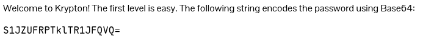

I prefer to use [CyberChef](https://gchq.github.io/CyberChef/) for quick decoding.

**Password: KRYPTONISGREAT**

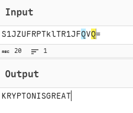

## Level 1

The Overthewire webpage also informed me that "you can find other levels of files in the /krypton/ directory". So let's see what is there.

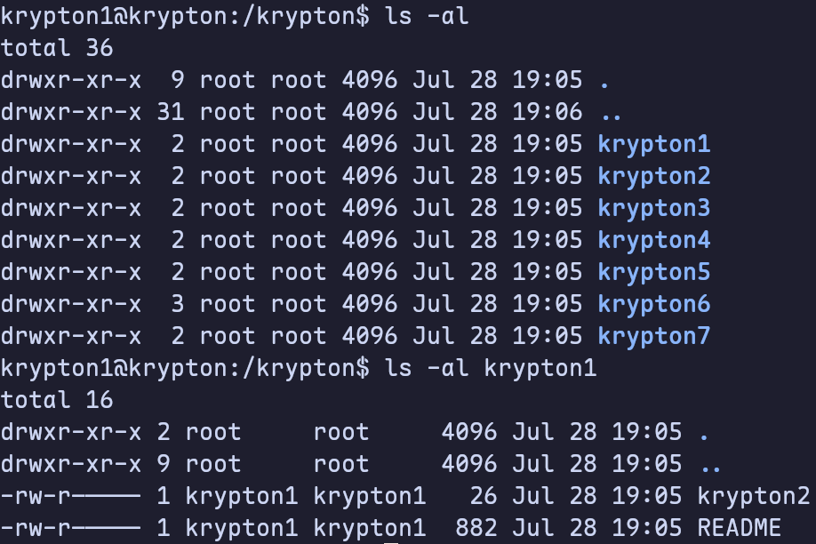

From there, I need to `cd` into `krypton1`, and read the README.

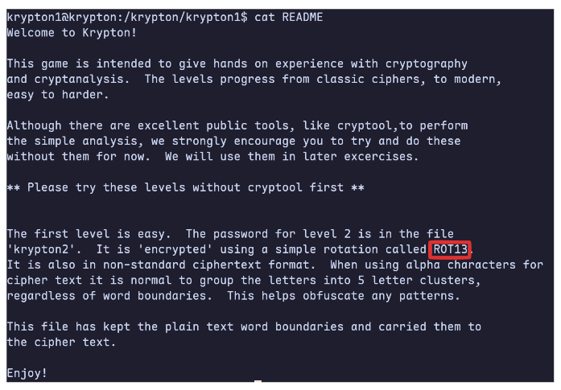

The instructions spell out that it’s a ROT13 cipher. ROT13 is a variation of a Caesar Cipher, which is a simple monoalphabetic substitution cipher. This means that each letter is substituted using the same alphabet shift (in this case, 13).

I used [ROT 13 decoder: Decrypt and convert ROT13 to text - cryptii](https://cryptii.com/pipes/rot13-decoder) to decode the cipher text (in `krypton2`).

**Password: ROTTEN**

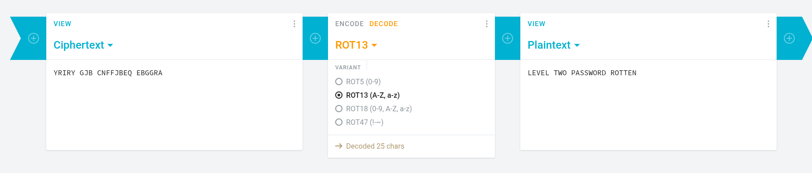

## Level 2

Let's see what's in the `krypton2/` directory.

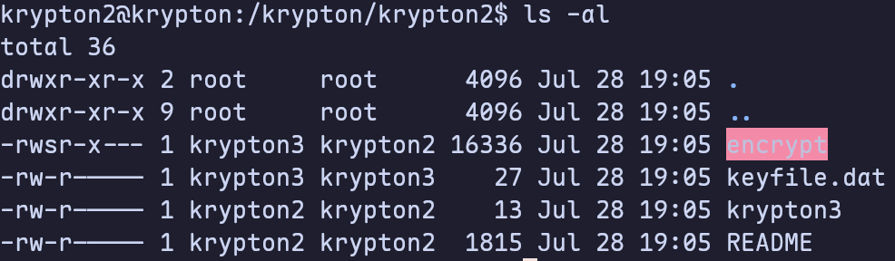

Read the `README` first. The screenshot below only shows a part of the file.

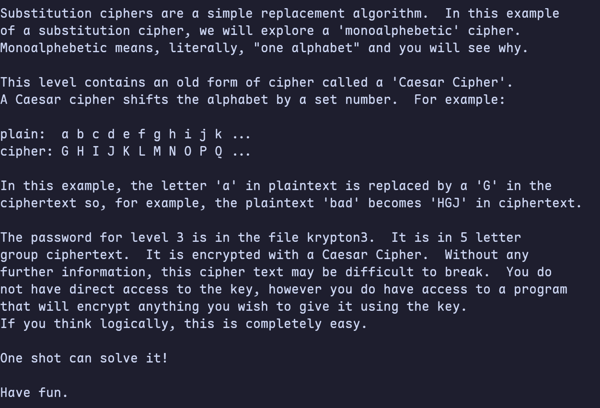

In short, I have an encrypted key file, and a program that will encrypt the input using the same method. According to the instructions, I learned that it uses Caesar cipher. That means I can use brute force to the number of shifts.

However, there is a better method, which is to use the given encryption program to encrypt my own information, thereby obtaining ciphertext, which can be used to infer the number of bits shifted. In other words, choose a plaintext attack (CPA).

```bash
cd /tmp
echo "A" > ./plain.txt
ln -s /krypton/krypton2/keyfile.dat ./keyfile.dat

/krypton/krypton2/encrypt ./plain.txt

cat ciphertext

# Output: M
```

Since the encrypted letter of A is M, the number of shifts is 12. After decryption, I obtained the password.

**Password: CAESARISEASY**

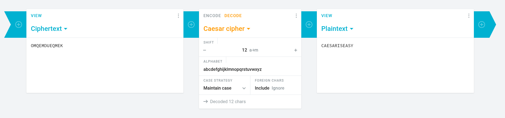

## Level 3

Let's what's in `krypton3/` directory.

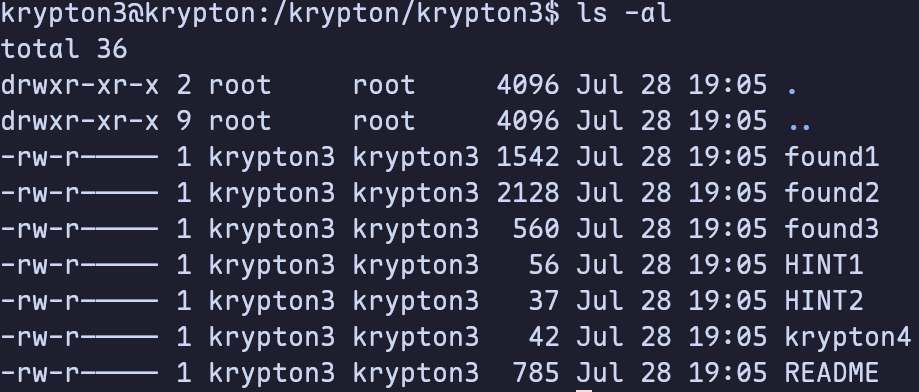

Read the `README` file first.

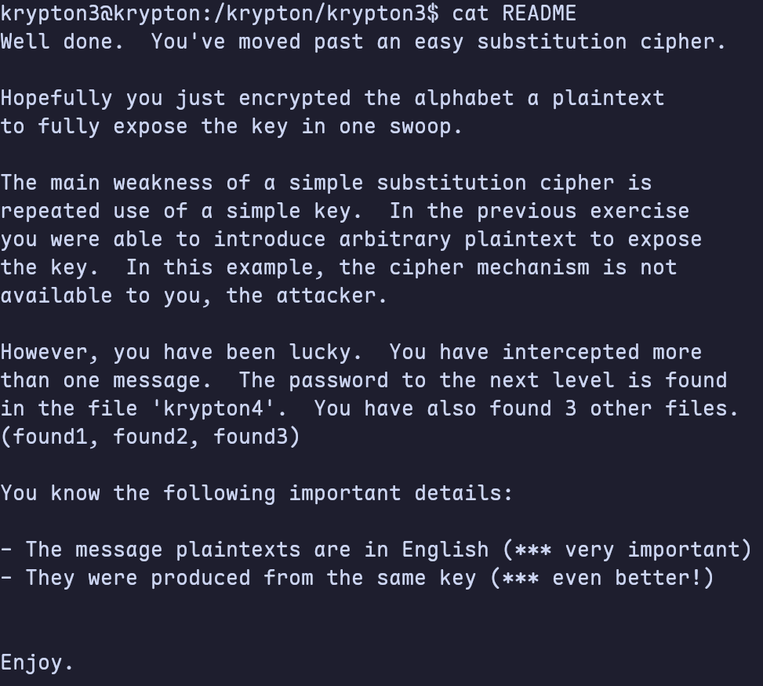

I looked at the available ciphertexts (found1, found2, etc), and noticed that they’re all in a similar format of 5 letters separated by spaces. But I didn’t know if that’s because of the cipher used, or a way of obfuscating any patterns. This reminds me of the decryption game in Week 2. I still remember that I used a method based on letter frequency analysis at the time. Let's try it.

I used this site [Frequency Analysis (online tool)](https://www.boxentriq.com/code-breaking/frequency-analysis) to analyse frequency of letters.

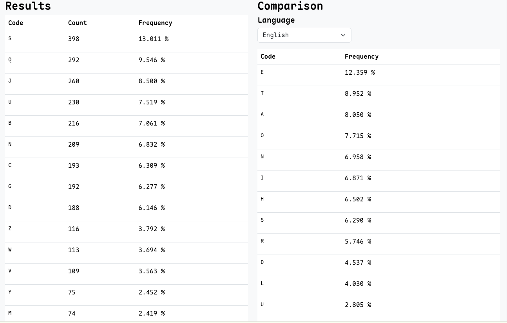

From this I thought the letter `S` in our ciphertext likely maps to `e` in plaintext, `Q` to `t`, and so on. But then I found that `JDS` is the most common three letter trigraph in the text. It likely maps to a common English three-letter word like `the` or `and`.

If this is the case, then the letters are not simply replaced according to their frequency. Rather than `J` mapping to `A`, for example, it could map to `T` (if `JDS` -> `the`)

Then I read the cipher text. I found that `VV` maps to the same letter twice, and `UU` map to another repeated letter later on in the text. Only certain letters in the English language are repeated (e.g. `S`, `T`, `E`) which helps narrow my choices down further.

```text
KSVVW BGSJD SVSIS VXBMN YQUUK BNWCU ANMJS
```

After trying some times, I got the password.

**Password: BRUTE**

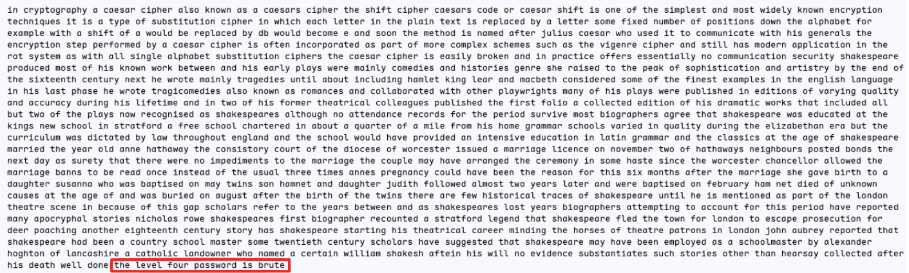

## Level 4

Similarly, I checked the home directory at first. And I also found a `README` file. It said that this level uses a [Vigenère cipher - Wikipedia](https://en.wikipedia.org/wiki/Vigen%C3%A8re_cipher) and the key length is 6. I used this site [Vigenere Cipher Solver - Online Decoder, Encoder, Translator](https://www.dcode.fr/vigenere-cipher) to decrypt it.

Copy the text from `found1` into the website. Type in 6 for the key length and click the decrypton button. Then I got the key `FREKEY`.

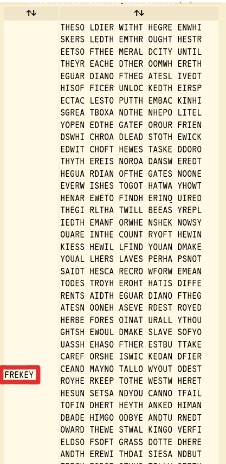

Using the key to decrypt the cipher text, I got the password.

**Password: CLEARTEXT**

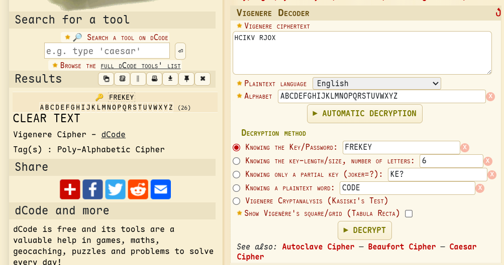

## Level 5

Let's read the `README` first. It said that no key length will be provided. So my first goal then will be to figure out the key length, then use that to find the key.

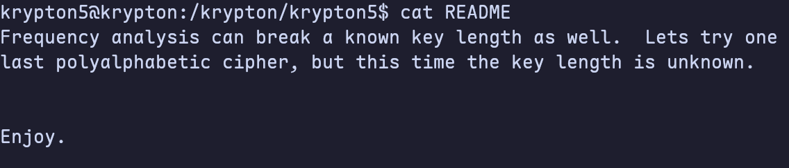

I went back to [Vigenere Cipher Solver - Online Decoder, Encoder, Translator](https://www.dcode.fr/vigenere-cipher), and entered the text from `found1` and clicked the "Automatic Decryption" button. Then I got the key `KEYLENGTH`.

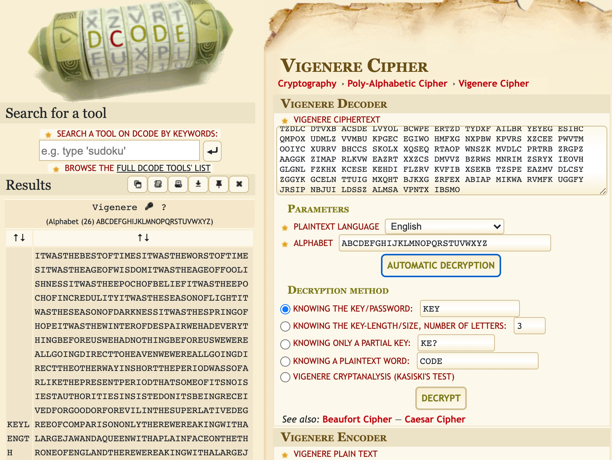

Using the key to decrypt the cipher text, I got the password.

**Password: RANDOM**

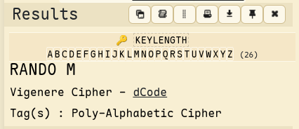

## Level 6

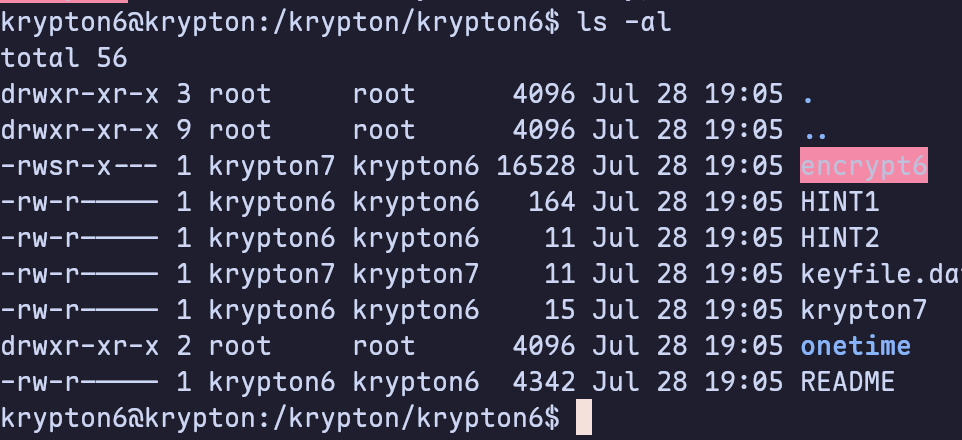

Let's read the `README` first. The `README` is pretty long this time, explaining why randomness in cryptography is important, how one-time pads work, and a very brief introductory to modern ciphers. It said that this level will use a stream cipher. Furthermore, I will be able to do chosen-plaintext attacks (CPA) using our input, plus a random number.

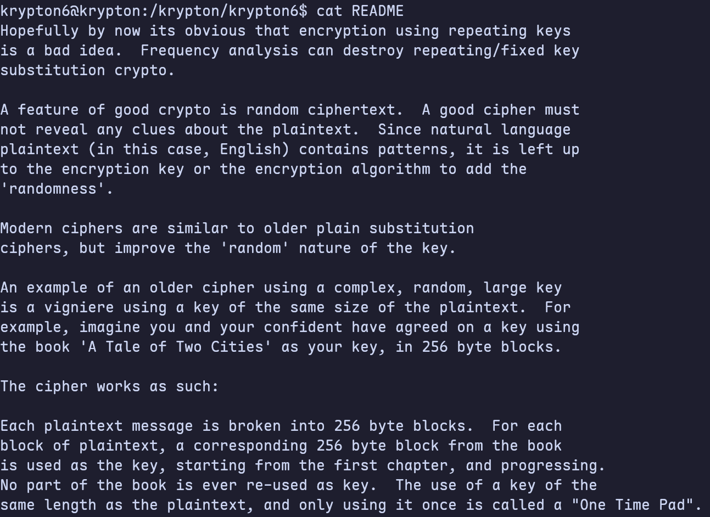

Let’s make a file in /tmp, and fill it with 40 "A". Then run the encryption program `encrypt6` to get the corresponding cipher text.

```bash
$ python -c 'print("A" * 40)' > plain
$ /krypton/krypton6/encrypt6 plain cipher
$ cat cipher
EICTDGYIYZKTHNSIRFXYCPFUEOCKRNEICTDGYIYZ
```

With the encryption result, given a shorter cipher text like `PNUKLYLWRQKGKBE`, I can know the shift of each letter, then use that to remap the flag ciphertext.

```python
ciphertext = 'PNUKLYLWRQKGKBE'
key = 'EICTDGYIYZKTHNSIRFXYCPFUEOCKRN'

for c, k in zip(ciphertext, key):
    p = ord('A') + ((ord(c) - ord(k)) % 26)
    print(chr(p), end='')

print()
```

After executing this script, I got the password.

**Password: LFSRISNOTRANDOM**

## Level 7

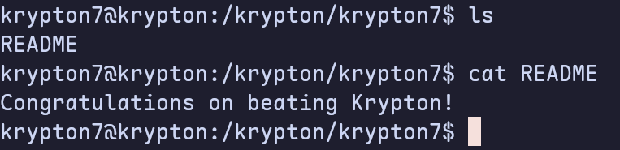
