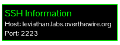
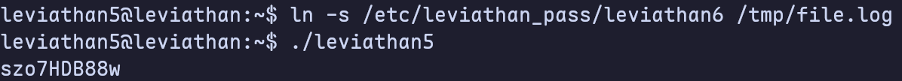
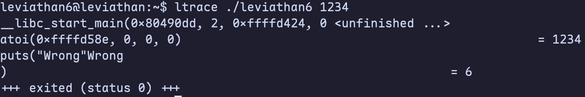

# Leviathan

## Level 0

After finding the SSH connection information in the upper left corner of the page, I used the following command to connect to the overthewire server.

```bash
ssh leviathan0@leviathan.labs.overthewire.org -p 2223 -o PreferredAuthentications=password
```



After logging onto the server, I used the `ls -a` command and found a hidden folder named `.backup`. Inside this folder, I found a file named b.html and found the password inside it.

**Password: 3QJ3TgzHDq**


## Level 1

After logging onto the server, I used the `ls -a` command and found an executable file called **check**. So I ran it.


It seems that the executable file is checking for a password. I thought this might mean that there was a password string that needed to be compared with what I entered. I used `ltrace` to see which libraries this program called.


I found that the program called `strcmp()`. It compares the input characters with "sex". Therefore, the password is "sex". I ran `check` again and entered "sex", and obtained the password for level 2.

**Password: NsN1HwFoyN**


## Level 2

After logging onto the server, I used the `ls -a` command and found an executable file called **printfile**. So I ran it.


Based on the output prompt, I created a temporary file and reran the program to print the file.


Nothing seems to have happened. So I tried to use this program to print the file which contains the password.


It seems not work. Let's see what will happen if I run it with `ltrace`.


The program uses `access()` to check whether the file exists, then uses `system("/bin/cat <file>")` to print the contents. But `access()` only checks the first filename, and `cat` command can handle multiple files. And system treats spaces as separators. If I use a file containing spaces, the `cat` command will treat this file as two files.

```bash
touch /tmp/pass link
touch /tmp/pass

./printfile /tmp/"pass link"
```

After running commands above, I got the following response.


It works! But how can I make it output the file containing the password? I remember that when I used `ls` command earlier, I found that the user owning the `printfile` executable is **leviathan3**. This means that although I cannot directly obtain the password, I can create a link to this file. When the program is executed, it has the permissions of reading the password.

Since I can't create files in the `home` directory, I need to create the link in the `tmp` directory.

```bash
cd /tmp
ln -s /etc/leviathan_pass/leviathan3 ./link

~/printfile "./pass link"
```

Then, I got the password.

**Password: f0n8h2iWLP**


## Level 3

After logging in, follow the same procedure. First, use `ls` to check what is in the home directory. I found an executable file named level3. Run it to see what information it contains.


Another password. Let’s go ahead and run `ltrace` to see what the library calls are for this program.


I found that strcmp is being called 2 times. The first one is just to confuse people. The second one is the key - "snlprintf". Then I tried to run the executable again and input "snlprintf". It said that I've got shell. After I type `whoami` command, it output `leviathan4`. This means that I have leviathan4's privileges. So I can use `cat` to get the password.

**Password: WG1egElCvO**


## Level 4

After logging in, I also used `ls -al` command first and found a directory called `.trash`. Then I found an executable file named `bin`. After running it, it output a string of binary code.


Then I went online and used [Binary to Text Translator](https://www.rapidtables.com/convert/number/binary-to-ascii.html) to convert it to text. I got the output, and it is the password.

**Password: 0dyxT7F4QD**


## Level 5

Also use `ls -al` command to find if there are some things in the home directory. Then I found a executable named leviathan5.
After running it, it output "Cannot find /tmp/file.log".


So it seems that the executable is trying to pull information on a file that doesn't exist. Let's use `ltrace` to see what's being called.


I found that the executable is using fopen on `/tmp/file.log`. I immediately thought of creating a link file pointing to the file containing the password and naming it "file.log". And I ran this executable again to get the password.

**Password: szo7HDB88w**



## Level 6

Similarly, I used `ls -al` command and found an executable file named leviathan6. After running it, it output a prompt saying "usage: ./leviathan6 <4 digit code>". So I tried to run it again with a 4 digit code.


Then I tried using `ltrace` to find something. But it didn't work. I found nothing useful.



So I tried to brute force it. I wrote a shell script to do it.

```bash
#!/bin/bash

for i in {0000..9999} do
    ~/leviathan6 $i
done
```

After running for 20 seconds, I got the shell.

**Password: qEs5Io5yM8**


### Addition

After playing the Narnia challenge, I thought I could use the GDB debugging method to complete this challenge (e.g. reverse engineering).


I found a `jne` operation. There is a comparison before this jump, which is most likely comparing the password with the value I entered. As for which register, eax or ebp, contains the address I want, I can check by running the program.

After executing the program and entering 0000, I found that the data stored in eax was 0. At the same time, another address (ebp minus 0xc) stored a 4-digit number, 7123. Therefore, this 4-digit number was the answer I was looking for.


After running the `leviathan6` program and entering 7123, I got the shell.


## Level 7

This level is not challenging; it is the final level. There is only one congratulatory message.


